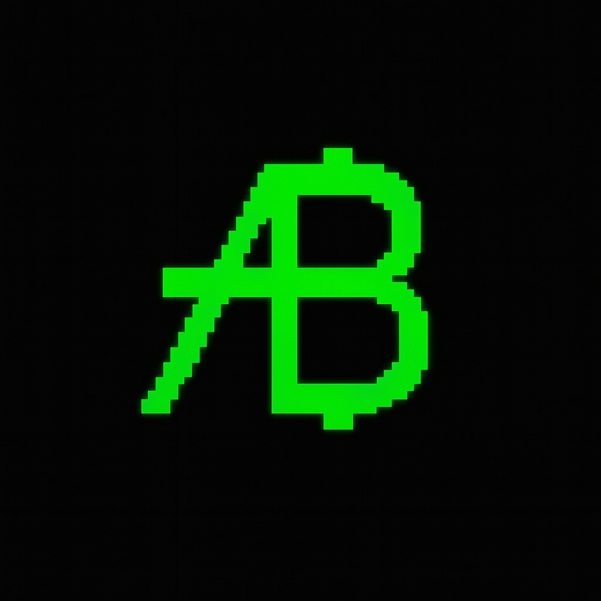
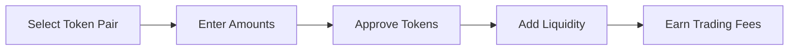

<div align="center">
  
  
  # AB.LAND
  ### The Ultimate Decentralized Token Launchpad
  
  [](https://x.com/abdotland)
  
  **Democratizing token creation, one innovation at a time.**
  
 [🐦 Twitter](https://x.com/abdotland)
  
</div>

---

## 🌟 Overview

**AB.LAND** is a next-generation decentralized token launchpad engineered on AB Chain, revolutionizing how tokens are created, launched, and traded. Our platform combines cutting-edge blockchain technology with intuitive user experience to democratize access to decentralized finance.

### ✨ Why Choose AB.LAND?

- 🎯 **Zero-Code Solution**: Launch professional tokens without technical expertise
- ⚡ **Lightning Speed**: Sub-second transactions with minimal fees (<$0.01)
- 🔒 **Enterprise Security**: Audited smart contracts with institutional-grade protection
- 🌊 **Instant Liquidity**: Automated market making with fair launch mechanisms
- 📱 **Mobile-First**: Seamless experience across all devices
- 📊 **Advanced Analytics**: Real-time insights and comprehensive metrics

## 🚀 Core Features

<table>
<tr>
<td width="50%">

### 🎯 **One-Click Token Creation**
```
✨ No-code token deployment
🎨 Rich metadata customization
⚙️ Flexible tokenomics
🚀 Instant AB Chain deployment
```

### 🔒 **Enterprise Security**
```
🛡️ Multi-audit smart contracts
🔐 Non-custodial architecture
🔍 Open-source transparency
🏛️ Multi-signature governance
```

### 📊 **Professional Analytics**
```
📈 Real-time market data
📉 Advanced charting tools
👥 Holder analytics
💹 Trading insights
```

</td>
<td width="50%">

### ⚡ **Lightning Performance**
```
🚄 Sub-second finality
💰 Ultra-low fees (<$0.01)
🔄 High-throughput processing
⚖️ Scalable infrastructure
```

### 💧 **Instant Liquidity**
```
🤖 Automated pool creation
🔄 Built-in DEX integration
🛡️ Anti-rug mechanisms
⚖️ Fair launch protocols
```

### 📱 **Mobile-First Experience**
```
📱 Progressive Web App
🔗 Universal wallet support
👆 Touch-optimized UI
🌐 Cross-platform compatibility
```

</td>
</tr>
</table>

##  System Architecture

<div align="center">

</div>

###  Project Structure

```bash
AB.LAND/
├── 🔗 contracts/              # Smart Contract Layer
│   ├── ABTokenFactory.sol     # Token creation engine
│   ├── ABLiquidityManager.sol # DEX & liquidity management
│   ├── ABToken.sol           # Standard token implementation
│   └── audits/               # Security audit reports
├── 🎨 frontend/               # User Interface Layer
│   ├── src/
│   │   ├── components/       # Reusable UI components
│   │   ├── pages/           # Application pages
│   │   ├── hooks/           # Custom React hooks
│   │   ├── utils/           # Utility functions
│   │   └── types/           # TypeScript definitions
│   └── public/              # Static assets
├── ⚙️ backend/                # API & Business Logic
│   ├── src/
│   │   ├── controllers/     # Request handlers
│   │   ├── routes/          # API endpoints
│   │   ├── services/        # Business logic
│   │   ├── middleware/      # Custom middleware
│   │   └── utils/           # Helper functions
│   └── prisma/              # Database schema & migrations
├── 🚀 scripts/               # Automation & Deployment
├── 📚 docs/                  # Technical documentation
├── 🧪 tests/                 # Comprehensive test suites
└── 🔄 .github/               # CI/CD workflows
```

##  Technology Stack

<table>
<tr>
<td width="25%" align="center">

### 🔗 **Blockchain**


- **AB Chain** - High-performance L1
- **Solidity ^0.8.19** - Smart contracts
- **Hardhat** - Development framework
- **OpenZeppelin** - Security libraries
- **Ethers.js** - Blockchain interaction

</td>
<td width="25%" align="center">

###  **Frontend**


- **React 18** - UI framework
- **TypeScript** - Type safety
- **Styled Components** - CSS-in-JS
- **React Query** - Data fetching
- **React Router** - Navigation
- **Framer Motion** - Animations

</td>
<td width="25%" align="center">

### ⚙️ **Backend**


- **Node.js 18+** - Runtime
- **Express.js** - Web framework
- **TypeScript** - Type safety
- **Prisma** - Database ORM
- **PostgreSQL** - Primary database
- **Redis** - Caching layer
- **Socket.io** - Real-time updates

</td>
<td width="25%" align="center">

### 🚀 **DevOps**


- **Docker** - Containerization
- **GitHub Actions** - CI/CD
- **Vercel** - Frontend hosting
- **Railway** - Backend hosting
- **IPFS** - Decentralized storage
- **Sentry** - Error monitoring

</td>
</tr>
</table>

## 🚀 Quick Start


### 📋 Prerequisites

<table>
<tr>
<td width="50%">

**🛠️ Development Environment**
- Node.js 18+ 
- npm/yarn 
- Git 

</td>
<td width="50%">

**🔗 Blockchain Setup**
- MetaMask 
- AB Chain RPC configured
- Test ABL tokens for fees

</td>
</tr>
</table>

### ⚡ One-Click Setup

```bash
# 🚀 Clone and setup everything
git clone https://github.com/your-username/AB.LAND.git
cd AB.LAND
npm run setup  # Installs all dependencies and sets up environment
```

<details>
<summary><b>📖 Manual Setup (Click to expand)</b></summary>

#### 1️⃣ **Clone Repository**
```bash
git clone https://github.com/your-username/AB.LAND.git
cd AB.LAND
```

#### 2️⃣ **Install Dependencies**
```bash
# 📦 Install all project dependencies
npm install

# 🎨 Frontend dependencies
cd frontend && npm install && cd ..

# ⚙️ Backend dependencies  
cd backend && npm install && cd ..

# 🔗 Contract dependencies
cd contracts && npm install && cd ..
```

#### 3️⃣ **Environment Configuration**
```bash
# 📝 Copy environment templates
cp .env.example .env
cp frontend/.env.example frontend/.env
cp backend/.env.example backend/.env

# ✏️ Edit configuration files
nano .env  # Add your API keys and configuration
```

#### 4️⃣ **Start Development Environment**
```bash
# 🚀 Start all services simultaneously
npm run dev

# 🔄 Or start services individually:
npm run dev:frontend   # Frontend (port 3000)
npm run dev:backend    # Backend (port 8000)
npm run dev:contracts  # Local blockchain (port 8545)
```

#### 5️⃣ **Deploy Smart Contracts**
```bash
# 🔨 Compile and deploy to local network
cd contracts
npm run compile
npm run deploy:local
```

</details>

### 🌐 Access Points

<div align="center">

| Service | URL | Status |
|---------|-----|--------|
| 🎨 **Frontend** | [`http://localhost:3000`](http://localhost:3000) |  |
| ⚙️ **Backend API** | [`http://localhost:8000`](http://localhost:8000) |  |
| 🔗 **Blockchain RPC** | [`http://localhost:8545`](http://localhost:8545) |  |
| 📚 **API Docs** | [`http://localhost:8000/docs`](http://localhost:8000/docs) |  |

</div>

---

## 📖 User Guide

### 🪙 Creating Your First Token


**Step-by-step process:**

1. **🔗 Connect Wallet** - Link your MetaMask to AB.LAND
2. **📝 Token Details** - Name, symbol, supply, and description
3. **💰 Pay Fee** - 0.1 ABL creation fee
4. **✅ Confirm** - Sign transaction and deploy
5. **🎉 Success** - Your token is live and tradeable!

### 💧 Providing Liquidity

**Earn fees by providing liquidity:**



### 🔄 Token Trading

**Simple and fast token swaps:**

- **⚡ Instant swaps** with minimal slippage
- **📊 Real-time pricing** and market data
- **🔒 MEV protection** for secure trading
- **📱 Mobile-optimized** interface

## 🧪 Testing & Quality Assurance


### 🚀 Quick Test Commands

```bash
# 🧪 Run comprehensive test suite
npm run test:all

# ⚡ Quick tests (unit + integration)
npm run test:quick

# 📊 Generate coverage report
npm run test:coverage

# 🔍 Watch mode for development
npm run test:watch
```

<details>
<summary><b>📋 Detailed Testing Commands</b></summary>

```bash
# 🎨 Frontend tests
cd frontend && npm test

# ⚙️ Backend tests  
cd backend && npm test

# 🔗 Smart contract tests
cd contracts && npx hardhat test

# 🌐 End-to-end tests
npm run test:e2e

# 🔒 Security audit
npm run audit:security
```

</details>

### 📊 Test Coverage

| Component | Coverage | Status |
|-----------|----------|--------|
| 🔗 **Smart Contracts** | 98% |  |
| ⚙️ **Backend API** | 95% |  |
| 🎨 **Frontend Components** | 92% |  |
| 🌐 **E2E Scenarios** | 88% |  |

## 🚀 Deployment

### Smart Contracts

```bash
# Deploy to AB Chain testnet
npx hardhat run scripts/deploy.js --network abchain-testnet

# Deploy to AB Chain mainnet
npx hardhat run scripts/deploy.js --network abchain-mainnet

# Verify contracts
npx hardhat run scripts/verify.js --network abchain-mainnet
```

### Frontend (Vercel)

```bash
# Install Vercel CLI
npm i -g vercel

# Deploy
cd frontend
vercel --prod
```

### Backend (AWS/Railway)

```bash
# Build production image
docker build -t abland-backend ./backend

# Deploy to your preferred platform
# (AWS ECS, Railway, DigitalOcean, etc.)
```

## 📊 API Documentation

Our REST API provides comprehensive access to platform data:

- **Tokens**: CRUD operations for token management
- **Users**: User profiles and authentication
- **Analytics**: Trading metrics and statistics
- **Transactions**: Transaction history and details

**Base URL**: `https://api.ab.land/v1`

**Interactive Documentation**: https://api.ab.land/docs

### Example API Calls

```javascript
// Get all tokens
GET /api/tokens?page=1&limit=20&sortBy=newest

// Get token details
GET /api/tokens/0x1234567890123456789012345678901234567890

// Create new token
POST /api/tokens
{
  "name": "My Awesome Token",
  "symbol": "MAT",
  "totalSupply": "1000000",
  "decimals": 18,
  "creator": "0xabc...",
  "transactionHash": "0xdef..."
}

// Get trending tokens
GET /api/tokens/trending?limit=10

// Get platform statistics
GET /api/tokens/stats
```

---

## 🤝 Contributing


We ❤️ contributions! Join our vibrant developer community and help shape the future of decentralized token creation.

### 🚀 Quick Contribution Guide

```bash
# 1️⃣ Fork & Clone
git clone https://github.com/YOUR_USERNAME/AB.LAND.git
cd AB.LAND

# 2️⃣ Create Feature Branch
git checkout -b feature/your-amazing-feature

# 3️⃣ Make Changes & Test
npm run test:all
npm run lint:fix

# 4️⃣ Commit & Push
git commit -m "feat: add amazing feature"
git push origin feature/your-amazing-feature

# 5️⃣ Create Pull Request
# Visit GitHub and create your PR!
```

### 📋 Contribution Areas

<table>
<tr>
<td width="25%" align="center">

**🔗 Smart Contracts**
- Gas optimization
- Security enhancements
- New features
- Audit fixes

</td>
<td width="25%" align="center">

**🎨 Frontend**
- UI/UX improvements
- Mobile responsiveness
- Performance optimization
- Accessibility

</td>
<td width="25%" align="center">

**⚙️ Backend**
- API enhancements
- Database optimization
- Caching strategies
- Monitoring

</td>
<td width="25%" align="center">

**📚 Documentation**
- Technical guides
- API documentation
- Tutorials
- Translations

</td>
</tr>
</table>

### 🏆 Recognition

Top contributors get:
- 🎖️ **Contributor NFT badges**
- 🪙 **ABL token rewards**
- 🌟 **Featured on our website**
- 🎯 **Early access to new features**

## 🔐 Security

### Smart Contract Security

- ✅ **Audited** by leading security firms
- ✅ **OpenZeppelin** battle-tested libraries
- ✅ **Slither** static analysis
- ✅ **Mythril** symbolic execution
- ✅ **Comprehensive** test coverage (>95%)

### Platform Security

- 🔒 **HTTPS** everywhere
- 🔒 **Rate limiting** on all endpoints
- 🔒 **Input validation** and sanitization
- 🔒 **SQL injection** protection
- 🔒 **XSS** protection
- 🔒 **CSRF** protection

### Responsible Disclosure

If you discover a security vulnerability, please email us at security@ab.land. We appreciate responsible disclosure and will respond promptly to address any issues.

---

## 📄 License

<div align="center">


**Open Source • Community Driven • Decentralized**

This project is licensed under the [MIT License](LICENSE) - feel free to use, modify, and distribute.

</div>

---

## 🌐 Community & Support

<div align="center">

### 🔗 **Official Links**

[](https://ab.land)
[](https://docs.ab.land)
[](https://api.ab.land)


### 📊 **Project Stats**


</div>

## 📞 Support

- **Email**: support@ab.land
- **Telegram**: https://t.me/abland_support
- **Discord**: https://discord.gg/abland
- **GitHub Issues**: https://github.com/abland/ab.land/issues

---

## 🙏 Acknowledgments

<div align="center">

**Special thanks to our amazing ecosystem partners:**

<table>
<tr>
<td align="center" width="25%">
 
  <sub><b>Security Libraries</b></sub>
</td>
<td align="center" width="25%">

  <sub><b>Development Tools</b></sub>
</td>
<td align="center" width="25%">

  <sub><b>Frontend Framework</b></sub>
</td>
<td align="center" width="25%">
 
  <sub><b>Type Safety</b></sub>
</td>
</tr>
</table>

**And our incredible community of contributors, testers, and supporters! 🚀**

</div>

---

<div align="center">
 
  
  **🌟 Making token creation accessible to everyone, everywhere 🌟**
  
  <sub>© 2024 AB.LAND • Empowering the decentralized future</sub>
</div>
